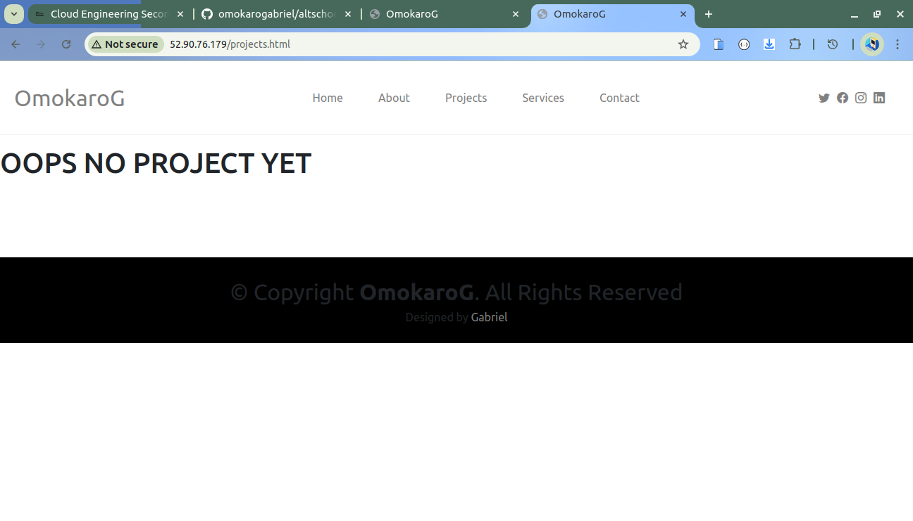
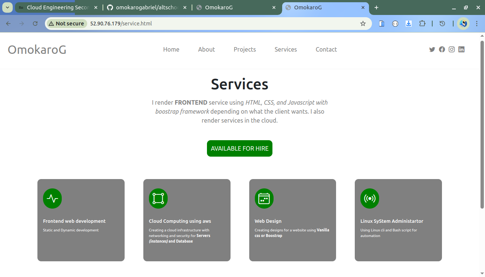
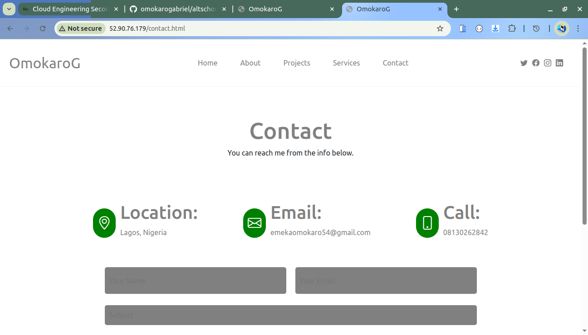

## **Cloud Engineering Second Semester Examination Project**

_This Exam uses the Modern Approach (AWS)_

## **Setting up the aws infrastructure**

**List of resources used for the infrastructure**

- **vpc** (For Creating the isolated network within the cloud, it uses 10.0.0.0/16 cidr block and has total of 256 networks and each networks will have total IP of 254).

```bash
aws ec2 create-vpc --cidr-block 10.0.0.0/16 --tag-specifications 'ResourceType=vpc, Tags=[{Key=Name, Value=MyVPC}]'
```

- **Igw** (For allowing access to and fro within the internet to the vpc, and it is attached to the VPC).

```bash
aws ec2 create-internet-gateway --tag-specifications 'ResourceType=internet-gateway, Tags=[{Key=Name, Value=MyIGW}]'
```

- **route-table and route** (For routing or for direction of traffic arrange the network).

```bash
aws ec2 create-route-table --vpc-id vpc-00976cf179c37d4fc --tag-specification 'ResourceType=route-table, Tags=[{Key=Name, Value=MyPublicRouteTable}]'

aws ec2 create-route --route-table-id rtb-02aec2da260da42ce --destination-cidr-block 0.0.0.0/0 --gateway-id igw-0d29e295df140798f
```

- **subnet** (For breaking down networks into smaller segment, and the cidr block is 10.0.1.0/24, whereby this network has total of 254 IP addresses, it is linked with the route table).

```bash
aws ec2 create-subnet --vpc-id vpc-00976cf179c37d4fc --cidr-block 10.0.1.0/24 --region us-east-1 --tag-specification

aws ec2 attach-internet-gateway --internet-gateway-id igw-0d29e295df140798f --vpc-id vpc-00976cf179c37d4fc

aws ec2 associate-route-table --route-table-id rtb-02aec2da260da42ce --subnet-id subnet-0130bb2b3a6b76ab1 --region us-east-1
```

- **security group** (Virtual firwall that allows traffic from an ec2 instance to another be it port 80, port 22(ssh) or port 443, it is stateful).

```bash
aws ec2 create-security-group --group-name examSG --description "security group for ec2 instances" --vpc-id vpc-00976cf179c37d4fc

# ssh
aws ec2 authorize-security-group-ingress --group-id sg-0aa2c7b52d1dff232 --protocol tcp --port 22 --cidr 0.0.0.0/0

# http
aws ec2 authorize-security-group-ingress --group-id sg-0aa2c7b52d1dff232 --protocol tcp --port 80 --cidr 0.0.0.0/0
```

- **key-name** (For ssh access, either from a specified IP or from the internet).
*my key name is "AwsKey"*

- **ec2 instance with public IP enable** (For the server).

```bash
aws ec2 run-instances --image-id ami-0fc5d935ebf8bc3bc --instance-type t2.micro --key-name AwsKey --subnet-id subnet-0130bb2b3a6b76ab1 --security-group-ids sg-0aa2c7b52d1dff232 --associate-public-ip-address --tag-specifications 'ResourceType=instance,Tags=[{Key=Name,Value=MyServer}]' 
```

<!-- ## **Installing the packages and setting up the server**

_I have successfully ssh into my ec2_

```bash
ssh -i AwsKey ubuntu@52.90.76.179
```

_Instaling the packages_

```bash

# Update package library
sudo apt update

# Install Apache2 web server
sudo apt install apache2 -y

# Enable Apache2 to start on boot
sudo systemctl enable apache2

# Start Apache2 service
sudo systemctl start apache2

# Check Apache2 service status
sudo systemctl status apache2


# the aws has handled the firwall for us, so we dont need to install or enable ufw

# navigate into the directory
cd /var/www/html
git clone https://github.com/omokarogabriel/portfolio.git

``` -->


## **Using Ansible to install,configure and deploy the git repo**

**The inventory**
*It takes in the IP address for the host, and ssh into the ec2 instance using the private key*
```yml
webservers:
  hosts:
    52.90.76.179:
      ansible_user: ubuntu
      ansible_ssh_private_key_file: /home/omokaro/AwsKey
```

**The playbook**
*It runs all the tasks in the role*
```yml
---
- name: Apply webserver role on webservers and deploy git repository
  hosts: webservers
  become: yes
  roles:
    - webserver
    - git-repo
```


**Here is the repo to the Ansible file**
**[ansible file repo](https://github.com/omokarogabriel/my-first-static-inv-ansible)**

<!-- paste the ip address in the browser -->
*The IP address where the web page is hosted*
- 52.90.76.179

<!-- image of my web page -->

<!-- ```html

``` -->
**HOME PAGE**


<!-- **ABOUT PAGE**
 -->

**PROJECT PAGE**


**SERVICE PAGE**


**CONTACT PAGE**

